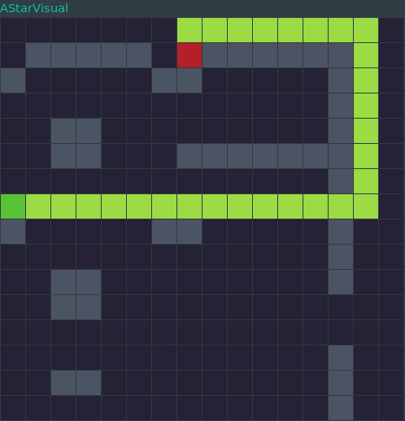

# A* Visualizer
Gets a map from stdin and then visualizes the A* pathfinding algorithm attempting to find the shortest path from the start to the end.

## Searching for a path

## Shortest path found
